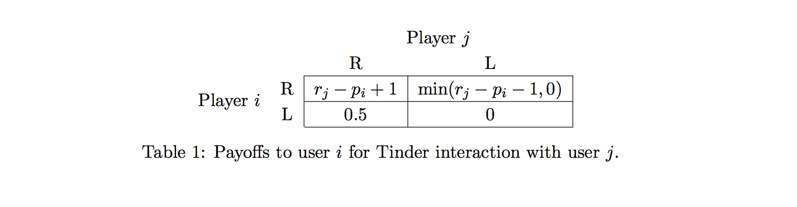

# CS136 Final Project: Modeling Tinder as a Reputation Game
Anya Zhang and Galen Lee

## Introduction

Launched in 2012, Tinder is a location-based dating app with an
estimated 50 million users. Users are shown the profiles of other users
who match certain criteria (eg. gender, age range, location) and are
given the option to either swipe right to indicate interest or left
otherwise. If two users swipe on each other, a "match" occurs, and they
are able to enter into conversation. Although users are able to display
many types of information, such as occupation, a bio, top Spotify
artists, and social media accounts, Tinder users empirically base the
majority of the decision whether or not to swipe based on the appeal of
displayed photos, which also take up the majority of real estate
onscreen.

## Theory

Although Tinder exhibits several features linked to concepts we’ve
studied this semester, such as information elicitation and recommender
systems, we decided it was best modeled as an example of a reputation
system where users essentially give feedback about the quality of each
other’s profiles, which the app uses to suggest new matches in the
manner of a centralized rather than decentralized market. The app thus
broadly satisfies the three requirements of a well-functioning
reputation system: 1. Useful reports from participants, and a
centralized system that 2. interprets others’ reputation information to
help participants make decisions and 3. changes the action set of
participants based on their own reputation.

## Model

Before defining the reputation game, we begin with assumptions used to
create our model. First and most importantly, we define each user by two
variables: The first is their physical attractiveness or “rating" =
\(r\) on a scale from 0.0 to 5.0, inspired by Tinder’s underlying
mechanism. The second which we introduce ourselves is the notion of
“pickiness" = \(p\), or the minimum rating needed by any other user to
merit a right swipe. These two factors are not entirely independent - we
assume in addition that \(p\) is within the range
\([r - 1.5, r + 1.5]\). These values are taken as immutable truths for
each user. Thus, given an interaction between any pair of users \(i,j\),
we only need to compare \(i\)’s pickiness and \(j\)’s rating to
determine \(i\)’s swipe behavior, and vice versa. For example, if \(i\)
has a pickiness of 3.4, \(i\) will swipe right on \(j\) if and only if
\(j\) has a minimum rating of 3.4. Whether \(j\) also swipes right on
\(i\) is determined independently (with the above caveat) by \(j\)’s
pickiness and \(i\)’s rating.

Based on these assumptions, we can fit Tinder nicely into the reputation
game model based on the repeated Prisoner’s Dilemma for peer-to-peer
markets. Payoffs to each user \(i\) for an interaction with user \(j\)
depend on whether each of them cooperate (swipe right) or defect (swipe
left). The normal-form representation of this utility function is shown
in the table below:




Importantly, utility is also affected by the actual values of \(r\) and
\(p\). If \(i\) and \(j\) match, \(i\)’s utility begins at 1 and is
improved by the amount by which \(j\)’s rating exceeds \(i\)’s
expectations. Similarly, if \(i\) matches \(j\) but \(j\) doesn’t match
\(i\) back, \(i\)’s utility begins at -1 and is improved by the same
amount up to 0. If \(j\) matches \(i\) but \(i\) doesn’t match back, we
assume that this boosts \(i\)’s ego by a small amount and increases
his/her utility by 0.5 \[1\]. If neither swipes on each other, utility
is 0 for both.

Thus, our goal for this project was to create a model of Tinder that
would simulate real-world user behavior based on the two variables,
accurately predict values for those variables from an app perspective,
and create a "deck" of candidates for users in a way that would maximize
their utility. Ideally, we would also want to show that our mechanism
incentivized truthful behavior.

## Simulation

For the sake of simplicity, rather than having a simulation that
calculated utilities and updated predictions simultaneously as Tinder
likely does for new users, we split the process into two distinct
section - one to train predictions, and one to use the results of our
predictions to calculate utilities.

We ran the training section in “rounds", randomly assigning each user a
single candidate for matching so that all user’s predictions would
update at more or less the same speed. The only constraint was that each
candidate could only be assigned to a user at most once (which we
maintained using the “seen" set), to avoid overfitting effects, although
the same candidate could be assigned to multiple users during a single
round. (Thus, the number of prediction rounds was by necessity limited
to the number of users). Using the results of swipes based on comparing
true values for ratings and pickiness in each round, we trained our
predictions for user rating and pickiness with the following code:

``` 
    def train(self, other, discount):
        diff = abs(self.p_hat - other.r_hat) 
        self_diff = max(diff, 1) * self.delta
        other_diff = max(diff, 1) * other.delta

        if self.p <= other.r and self.p_hat > other.r_hat:
            self.p_hat = round(max(self.p_hat - self_diff, 0.0), 2)
            other.r_hat = round(min(other.r_hat + other_diff, 5.0), 2)
        elif self.p > other.r and self.p_hat <= other.r_hat:
            self.p_hat = round(min(self.p_hat + self_diff, 5.0), 2)
            other.r_hat = round(max(other.r_hat - other_diff, 0.0), 2)
        self.delta = self.delta * discount
        other.delta = other.delta * discount
        return 
```
In other words, if our prediction matched the expected outcome, we
changed nothing. However, if \(i\) swiped right on \(j\)
(\(p_i \leq r_j\)) but we’d predicted that \(i\) would swipe left on
\(j\) (\(\hat{p_i} > \hat{r_j}\)), we would decrease \(\hat{p_i}\) by a
small amount and increase \(\hat{r_j}\) by a small amount. small amount
was determined by the magnitude of difference (
\(|\hat{p_i} > \hat{r_j}|\)), multiplied by `delta`, a factor that began
at 1.0 and slowly decreased by a factor of `discount` every round that
the parameter was used. We defined `discount` in `tinder.py` by
calculating the necessary value for it to begin at 1.0 and get to 0.1 by
the time we had finished predictions, leading it to converge at a
reasonable value. Since the expected number of times for a user’s
predictions to be adjusted was twice the number of rounds (any user
would show up once per round by default and another expected one time as
a candidate for another user), this was defined as `discount` =
\(0.1^{1/(2 \times \text{rounds})}\).

In the second section, we showed each user only the filtered candidates
who, by our predictions, would create stable matches with them (where
intuitively, a stable match between two users is one where each user has
a rating that is higher than the other user’s pickiness). As before,
each user’s real-world swipe behavior and utility was still computed
using true values - predictions were used only to create the candidate
list. In addition, we limited each user to 50 right swipes (similar to
Tinder’s daily limit) in order to incentivize better matches (which
gives more utility per match) in addition to raw number of matches.
Finally, we ranked the results in order of increasing user utility.

Importantly, as can be seen from the equations, a user’s behavior cannot
change her own rating, only her pickiness. Her pickiness is used to
determine which users to display to her, while her rating is used to
determine whether she should be displayed to others. Thus, in a
consideration of the strategy-proofness of the mechanism, it suffices to
show that pickiness is strategy-proof.

## Results

To test the accuracy of predictions, we ran this algorithm ten times and
took the average RMSE over the trials. By adjusting the following values
in addition to the algorithm outlined above, we managed to get RMSE for
300 users to a consistent \(\sim 0.12\) for both \(\hat{p}\) and
\(\hat{r}\):

  - initial value of `delta` (1.0)

  - value for `discount` to converge to (0.1)

  - number of prediction rounds (250)
  
Additionally, we observed that the type of user that tended to do well
under our mechanism had high enough ratings to get many right swipes
from other users, but not so high that they were too picky. However, the
less picky they were, the more utility they would also get from having
their expectations exceeded most of the time. Thus, typical high-ranking
users had ratings near 3.8-4.1 and minimum pickinesses for their
ratings, around 3.3-3.6. By adjusting the values for number of right
swipes and utility, the results could easily be manipulated to
prioritize any type of strategy, suggesting that more testing would help
determine an optimal approach from an app perspective. Given more time,
we’d also want to test to see whether reporting a different pickiness
(i.e. behaving in accordance to a different reported \(p\), but
calculating utilities using a true \(p\)) would benefit users and
attempt to design a mechanism to incentivize truthful behavior.
1.  Although normally a user who swipes left on another user can’t tell
    what their response is, under conditions like “superlikes", a user
    can see up front whether the other has liked them and can still
    choose to swipe left, presumably increasing their utility by a small
    amount
    
    
